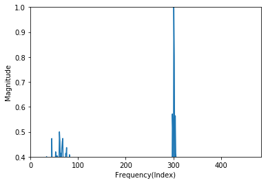
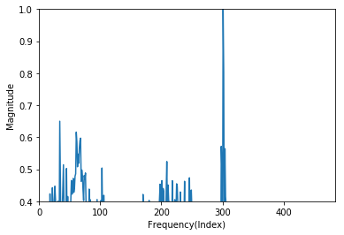

# Water Transfer Robot Fault Detection Using K-means and Neural Network
### 1. 프로젝트 기간 : 
- 2019.01 ~ 2020.12 (데이터 신뢰성 문제로 2020년 데이터 재획득, 가공) 

### 2. 프로젝트 주제 선정 이유 : 
1. 반도체 공정 연구소에서 웨이퍼를 식각하기 위한 과정에서 장비 내부의 웨이퍼 이송 로봇의 고장 등으로 웨이퍼 제작이 미뤄짐
2. 반도체 장비의 고장을 미리 예측할 수 있다면 공정과정 중 생기는 문제로 인한 비용을 줄일 수 있음

### 2. 프로젝트 목적 :
- 반도체 이송 로봇을 operation 하여 얻은 데이터를 이용하여 로봇 고장을 미리 예측할 수 있는 모델 설계

### 3. 프로젝트 과정 : 
#### 3.1. 장비 셋팅 

   
  > - 웨이퍼 이송 로봇(RR732, Rorze System)을 이용하여 데이터 취득 
  > - 웨이퍼 팔의 위치 이동을 파악하기 위해 장비의 핸들러 가장 상단에 3축 가속도 센서(ADXL335) 설치
  > - 실험에서 설정한 오류를 제외한 다른 오류의 발생을 제거하기 위하여 초음파 센서(Weather-proof Ultrasonic Sensor, DFRobot)와 카메라 설치 
 
 

#### 3.2. 데이터 취득  

  
  > - 가속도 센서를 이용하여 총 562개의 데이터 세트를 획득
  > - 초음파 센서와 카메라 데이터를 이용하여 의도하지 않은 비정상적인 데이터를 제외한 결과
  > - 하나의 데이터 세트는 x, y, z 축 3개로 구성되며 각 축의 데이터는 968개
  
   
  
#### 3.3. 데이터 전처리  
  > 1. 가속도 센서 데이터의 전압값 가속도 값으로 변환
  > 2. 가속도 센서 데이터 FFT로 주파수 영역 변환
  > 3. 센서 데이터 정규화하여 크기가 다른 3축 데이터 비교
  > 4. 대칭이 되는 주파수 영역 절반으로 축소 
  
  > 
  > <h6>[Preprocessed x-axis data]</h6>
 
  > 
  > <h6>[Preprocessed y-axis data]</h6>
  
  > 
  > <h6>[Preprocessed z-axis data]</h6>
  
   
  
#### 3.4. 데이터 선택
  > - 아래 그림처럼 특정 주파수 영역대에서 피크가 나타나는 특징이 뚜렷한 X 축 데이터 선택
  > 
  > <h6>[Preprocessed x-axis data]</h6>
  
  > - 0.4 이하의 데이터를 노이즈 처리하여 제거
   

#### 3.5. 오류 데이터 구성
  > - 산업용 계측기를 제조하여 판매하는 Fluke사의 진동 신호 기반의 이상 신호 검출 연구를 바탕으로 생성
  > - 정상 데이터부터 장비 고장 데이터까지 4단계로 구성
  > - 정상 데이터는 위의 x축 데이터
  

  > 
  > <h6>[1st order error data]</h6>
  > 
  > 초기에 낮은 주파수 영역에서 발생하는 이상치

  > 
  > <h6>[1st order error data]</h6>
  > 
  > 초기에 낮은 주파수 영역에서 발생하는 이상치
> 5. 데이터 특징 및 획득
> 6. 신경망 모델 구현
