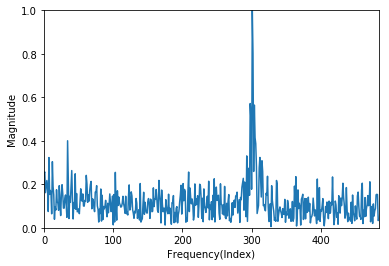

# Water Transfer Robot Fault Detection Using K-means
### 1. 프로젝트 기간 : 
- 2019.01 ~ 2020.12 (데이터 신뢰성 문제로 2020년 데이터 재획득, 가공) 
### 2. 프로젝트 주제 선정 이유 : 
1. 반도체 공정 연구소에서 웨이퍼를 식각하기 위한 과정에서 장비 내부의 웨이퍼 이송 로봇의 고장 등으로 웨이퍼 제작이 미뤄짐
2. 반도체 장비의 고장을 미리 예측할 수 있다면 공정과정 중 생기는 문제로 인한 비용을 줄일 수 있음

### 2. 프로젝트 목적
- 반도체 이송 로봇을 operation 하여 얻은 데이터를 이용하여 로봇 고장을 미리 예측할 수 있는 모델 설계

### 3. 프로젝트 과정 : 
#### 3.1. 장비 셋팅 

   
  > - 웨이퍼 이송 로봇(RR732, Rorze System)을 이용하여 데이터 취득 
  > - 웨이퍼 팔의 위치 이동을 파악하기 위해 장비의 핸들러 가장 상단에 3축 가속도 센서(ADXL335) 설치
  > - 실험에서 설정한 오류를 제외한 다른 오류의 발생을 제거하기 위하여 초음파 센서(Weather-proof Ultrasonic Sensor, DFRobot)와 카메라 설치 
  
#### 3.2. 데이터 취득  

  
  > - 가속도 센서를 이용하여 총 562개의 데이터 세트를 획득
  > - 초음파 센서와 카메라 데이터를 이용하여 의도하지 않은 비정상적인 데이터를 제외한 결과
  > - 하나의 데이터 세트는 x, y, z 축 3개로 구성되며 각 축의 데이터는 968개
  
#### 3.3. 데이터 전처리  
  > 1. 가속도 센서 데이터의 전압값 가속도 값으로 변환
  > 2. 가속도 센서 데이터 FFT로 주파수 영역 변환
  > 3. 센서 데이터 정규화하여 크기가 다른 3축 데이터 비교
  > 4. 대칭이 되는 주파수 영역 절반으로 축소 

  
   
  
  
  
#### 3.4. 오류 데이터 생성  
> 4. 오류 시나리오 구성
> 5. 데이터 특징 및 획득
> 6. 신경망 모델 구현
